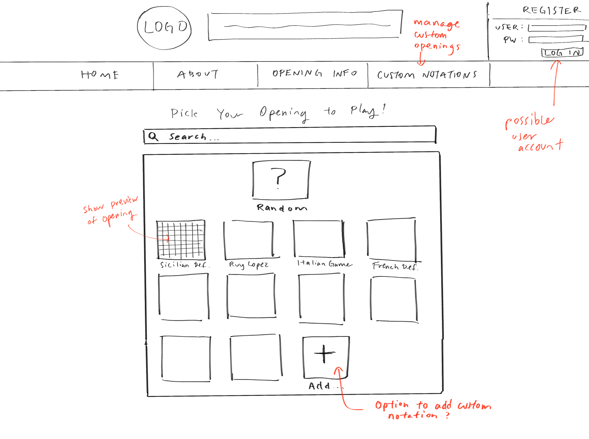
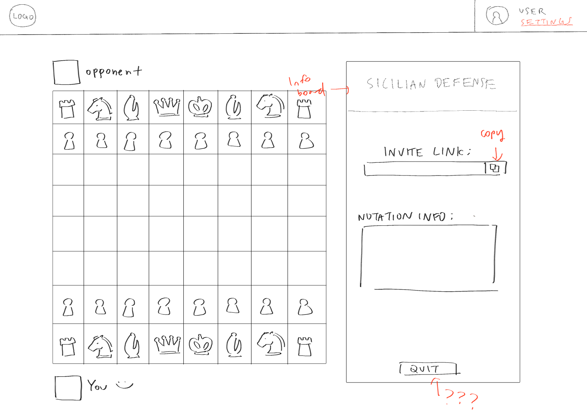
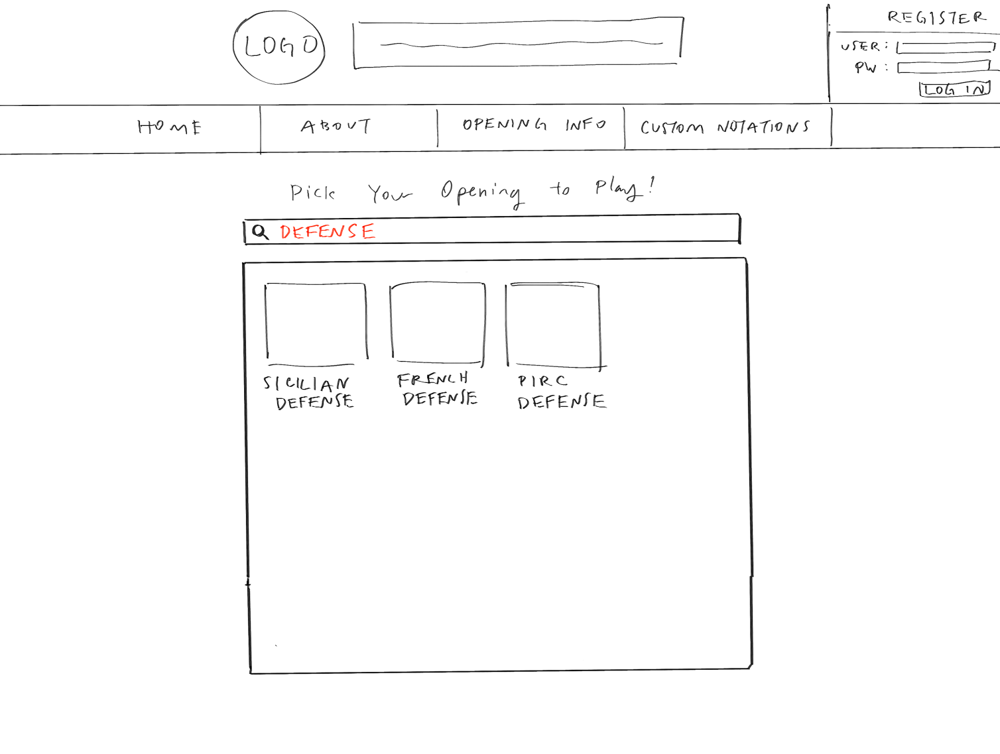

# Chess Opening Match Starter

## Project Description

For <b>intermediate and advanced Chess players</b>, a large part of improving in the game of Chess is understanding and practicing games at specific [opening positions](https://en.wikipedia.org/wiki/Chess_opening). 

Currently, practicing specific niche openings is a hassle; (1) your opponent often has to make a specific set of moves to begin with to "enter" the opening you want to practice and (2) solo analysis requires careful progammatic-like inputting of [chess notation](https://en.wikipedia.org/wiki/Algebraic_notation_(chess))). 

Our project would primarily <b>allow players to retrieve common opening positions</b> for players to practice, as the application's database would store <b>100+ notation sets of the most common opening positions</b>.

By retrieving these opening positions, players can <b>input the notation into other Chess websites for analysis</b>, or even potentially play games (against themselves or an [AI engine](https://en.wikipedia.org/wiki/Stockfish_(chess))) starting at the positions requested. 

## Project Task Requirements

### Minimal Requirements

1. As a user, I should be able to <b>retrieve starting position notations</b> from common openings that I will be able to plug into another chess applications (Lichess, Chess.com, etc.) to setup a board
2. As a user, I should be able to retrieve one of the more common opening positions by <b>clicking on a position card</b> from the starting page 
3. As a user, I should be able to retrieve the notation for a specific starting position I want using a <b>search bar</b>

### Standard Requirements

1. As a user, I should be able to <b>create and refer back</b> to my own custom openings that I've created.
2. As a user, I should be able to <b>favourite openings</b> and be able to refer to them at a later point.
3. As a user, I should be able to <b>randomly retrieve the notation for a specific position</b> by clicking on a button ("Give me a position")
4. As a user, I should be able to <b>quickly redirect myself</b> to another chess application.

### Stretch Requirements

1. As a user, I should be able to <b>make my own account</b> with a history of the past games I've played
2. As a user, I should be able to <b>play games against my friends</b>
3. As a user, I should be able to <b>play games by setting my own custom positions</b>

## Task Breakdown

### Task 1: Allow Retrieval of Starting Position Notations (Backend)

1. Design a <b>data structure</b> for storing position notations
2. Populate database with 100 sets of position notations (either manually or with a script)
3. Create an endpoint to retrieve a starting position

### Task 2: Create Most "Common Position" Cards to Click  (Frontend)

1. Implement a position card component (includes styling)
2. Populate the position cards with 10 common positions
3. Connect the card with the endpoint to retrieve a starting position

## Prototypes

### Prototype 1: Most Common Position Cards

### Prototype 2: Output Upon Notation Card Click

### Prototype 3: Output Upon Notation Search

